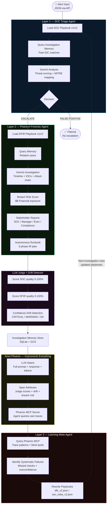

# PhantomSOC

> **Autonomous incident response platform that learns from every investigation using Arize Phoenix observability**

[](https://google.github.io/adk-docs/)
[](https://ai.google.dev/)
[](https://app.phoenix.arize.com)
[](https://cloud.google.com/run)
[](LICENSE)

Built for the **Google Cloud Rapid Agent Hackathon 2026 — Arize Track**

🔴 [Live Dashboard](https://phantomsoc-745097138732.us-central1.run.app/dashboard) · 🎥 [Demo Video](https://youtu.be/mAJ5f7dyKsk) · 📊 [Phoenix Traces](https://app.phoenix.arize.com/s/ssure-kumar01111)

---

## The Problem

Security teams receive **10,000+ alerts daily**. 80% are false positives. Real attacks get missed because analysts are overwhelmed. When incidents are found, junior analysts miss critical forensic steps. Lessons from bad investigations are never applied in real time.

**PhantomSOC solves this with three autonomous agents that get smarter with every investigation.**

---

## Architecture



---

## Self-Improvement Loop

```
Investigation runs
      ↓
Phoenix traces every Gemini reasoning step
      ↓
LLM Judge scores quality (0-100%)
      ↓
Confidence Drift Detector flags overconfidence
      ↓
Learning Agent queries Phoenix MCP for patterns
      ↓
Blind spots identified → Playbooks rewritten
      ↓
Next investigation uses updated playbooks → scores improve
```
## Why PhantomSOC Is Different

Most AI SOC agents investigate incidents.

PhantomSOC investigates, evaluates itself,
queries historical trace data through Phoenix MCP,
detects recurring blind spots,
and automatically updates future investigation playbooks.

It does not just automate security operations.
It continuously improves them.
---

## Demo Results

| Metric | Before Learning | After Learning | Change |
|---|---|---|---|
| DFIR Quality Score | 58% | 77% | **+19 points** |
| SOC Quality Score | 50% | 75% | **+25 points** |
| Confidence Drift | CRITICAL | WARNING | **Improved** |
| False Positive Filter | Manual | Automated triage | **Working** |
| Investigation Memory | Inactive | Active — cases recalled | **Working** |
| Playbook Version | v1 | v2 (auto-updated) | **Working** |
| Analyst Hours Saved | — | 13.38h per session | **Working** |
| Cost Saved | — | $602 per session | **Working** |
| MITRE Tactics Covered | 3 | 6 | **+100%** |
| Executive Report | Not generated | Auto-generated per case | **Working** |

---

## Tech Stack

| Component | Technology | Purpose |
|---|---|---|
| Agent Runtime | Google ADK 2.1.0 | Code-owned runtime for OpenInference tracing |
| LLM | Gemini 3.1 Flash Lite | All six Gemini calls per investigation |
| Observability | Arize Phoenix Cloud | LLM spans, trace storage, MCP server |
| Tracing | OpenInference google-genai | Auto-instruments every Gemini call |
| Phoenix MCP | @arizeai/phoenix-mcp | Learning Agent queries own trace data |
| Storage | Google Cloud Storage | Reports, playbooks, trend log persistence |
| Memory | SQLite | Cross-case IOC correlation |
| Hosting | Google Cloud Run | Public API endpoint |

> **Note:** Google ADK was chosen as the agent runtime because the Arize track requires a code-owned runtime for direct OpenInference instrumentation. Visual Agent Builder alone does not support tracing integration.

---

## What PhantomSOC Produces Per Investigation

```
Alert → PhantomSOC
           │
           ├── Triage Decision (FALSE_POSITIVE / ESCALATE)
           ├── Breach Risk Score (0-100) + Financial Exposure ($)
           ├── GDPR 72-Hour Notification Flag
           ├── DFIR Report (timeline, IOCs, MITRE ATT&CK chain)
           ├── Stakeholder Reports
           │     ├── SOC Analyst — technical details + containment
           │     ├── Security Manager — risk summary + status
           │     ├── Executive — business impact (non-technical)
           │     └── Compliance — GDPR/CCPA obligations
           ├── Autonomous IR Runbook (5-phase response plan)
           ├── Executive Report (saved to GCS)
           └── Arize Phoenix Traces (full audit trail)
```

---

## Arize Phoenix Integration

Phoenix is not just a logger — it is the **data source that powers the self-improvement loop**.

```
Gemini makes a decision
        ↓
OpenInference captures: full prompt, full response, token count, latency
        ↓
LLM Judge evaluates quality → score logged as Phoenix span attribute
        ↓
Confidence Drift logged: agent_confidence vs judge_score
        ↓
Learning Agent calls Phoenix MCP server at runtime
        ↓
Queries: "Which investigations scored below 70%? What feedback appeared?"
        ↓
Identifies blind spots → rewrites DFIR and SOC playbooks
        ↓
Next investigation uses v2 playbook → quality improves
```

**Six Gemini calls per investigation — all traced:**

| Call | Agent | Purpose |
|---|---|---|
| 1 | SOC Triage | Alert classification + threat scoring |
| 2 | Phantom Forensic | Full DFIR investigation |
| 3 | Phantom Forensic | Executive report generation |
| 4 | LLM Judge | SOC quality scoring |
| 5 | LLM Judge | DFIR quality scoring |
| 6 | Learning Agent | Blind spot analysis + playbook rewrite |

---

## Project Structure

```
phantomsoc/
├── agent/
│   ├── instrumentation.py      # Arize Phoenix tracing — GoogleGenAI instrumentor
│   ├── main.py                 # Local pipeline orchestrator
│   ├── server.py               # Cloud Run HTTP server + API endpoints
│   ├── core/
│   │   └── storage.py          # GCS persistence (reports, playbooks, trend)
│   └── phantomsoc/
│       ├── models.py           # Pydantic schemas for all data structures
│       ├── memory.py           # SQLite investigation memory store
│       ├── soc_agent.py        # Layer 1 — SOC Triage Agent
│       ├── phantom_agent.py    # Layer 2 — Phantom Forensic Agent
│       ├── judge.py            # LLM Judge + confidence drift detection
│       ├── learning_agent.py   # Layer 3 — Learning Meta-Agent
│       ├── impact.py           # Cost analysis + breach risk + stakeholder reports
│       ├── runbook.py          # Autonomous IR runbook generation
│       └── data/
│           ├── scenario_a.json # Credential stuffing + data exfiltration
│           ├── scenario_b.json # Same IOC — tests memory recall
│           └── scenario_c.json # Authorized pentest — false positive
├── playbooks/
│   ├── soc_rules_v1.json       # Initial SOC detection rules
│   └── dfir_v1.json            # Initial DFIR investigation checklist
├── dashboard.html              # Judge-facing demo dashboard
├── .gemini/
│   └── settings.json           # Phoenix MCP server configuration
├── Dockerfile                  # Cloud Run container
├── requirements.txt
└── .env.example
```

---

## API Endpoints

| Method | Endpoint | Description |
|---|---|---|
| GET | `/` | Service info |
| GET | `/health` | Health check |
| GET | `/dashboard` | Judge-facing web dashboard |
| POST | `/investigate` | Run investigation on any alert JSON |
| POST | `/demo` | Run full three-scenario pipeline |
| POST | `/learn` | Manually trigger Learning Agent |
| GET | `/trend` | Investigation quality scores from GCS |
| GET | `/metrics` | Aggregated system metrics |
| GET | `/runbooks` | List all generated runbooks |
| GET | `/reports` | List all executive reports from GCS |

---

## Setup

### Prerequisites
- Python 3.11+
- Node.js 18+
- Google AI Studio API key
- Arize Phoenix Cloud account (free tier)
- Google Cloud project

### Installation

```bash
git clone https://github.com/ssurekumar01111-hue/phantomsoc
cd phantomsoc
python -m venv venv
source venv/bin/activate  # Windows: venv\Scripts\activate
pip install -r requirements.txt
cp .env.example .env
# Fill in your API keys in .env
```

### Environment Variables

```bash
GOOGLE_API_KEY=your_gemini_api_key
PHOENIX_API_KEY=your_phoenix_api_key
PHOENIX_COLLECTOR_ENDPOINT=https://app.phoenix.arize.com/s/your-space/v1/traces
PHOENIX_PROJECT_NAME=phantomsoc
GOOGLE_CLOUD_PROJECT=your_gcp_project_id
GEMINI_MODEL=gemini-3.1-flash-lite
MEMORY_DB_PATH=./data/memory.db
GCS_BUCKET=your_gcs_bucket
LEARNING_AGENT_TRIGGER_N=3
CONFIDENCE_DRIFT_THRESHOLD=0.15
```

### Run Locally

```bash
python agent/main.py
```

### Deploy to Cloud Run

```bash
gcloud run deploy phantomsoc \
  --source . \
  --region us-central1 \
  --allow-unauthenticated \
  --memory 1Gi \
  --timeout 300
```

---

## Real World Use Cases

**SMB without a security team** — A 50-person company cannot afford a SOC analyst. PhantomSOC acts as automated Tier-1 and Tier-2 analyst, escalating only confirmed threats and delivering executive reports directly to the CEO.

**MSSP scaling investigations** — A managed security provider handling 50 clients uses PhantomSOC to handle Tier-1 triage across all clients simultaneously, freeing human analysts for complex cases only.

**Enterprise SOC alert fatigue** — A 20-analyst SOC team drowning in 50,000 daily alerts deploys PhantomSOC as their Tier-1 layer. Alert volume reaching human analysts drops by 80%.

**Post-incident learning** — After every major incident, the Learning Agent automatically updates detection playbooks — the institutional knowledge that normally leaves when a senior analyst resigns.

---

## Live Links

- 🔴 **Live Dashboard:** https://phantomsoc-745097138732.us-central1.run.app/dashboard
- 📊 **Phoenix Traces:** https://app.phoenix.arize.com/s/ssure-kumar01111
- 🎥 **Demo Video:** https://youtu.be/mAJ5f7dyKsk
- 💻 **GitHub:** https://github.com/ssurekumar01111-hue/phantomsoc

---

## License

Apache-2.0 — see [LICENSE](LICENSE)

---

*Built for the Google Cloud Rapid Agent Hackathon 2026 — Arize Track*
